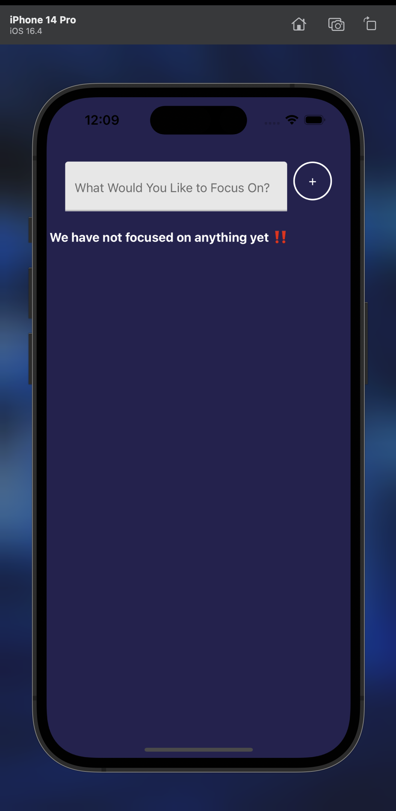
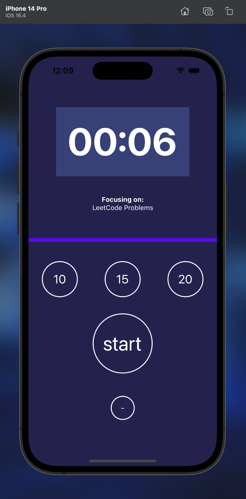
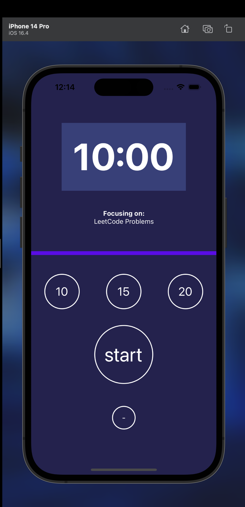
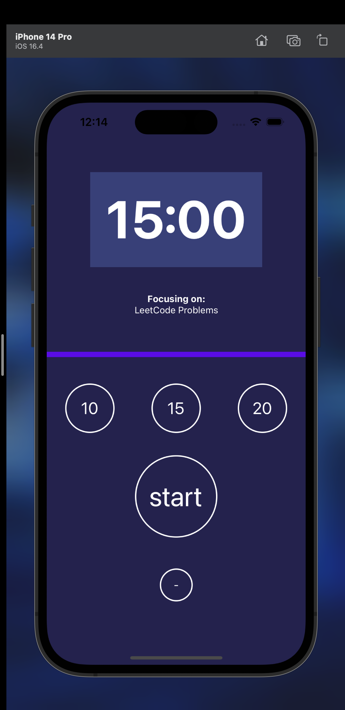
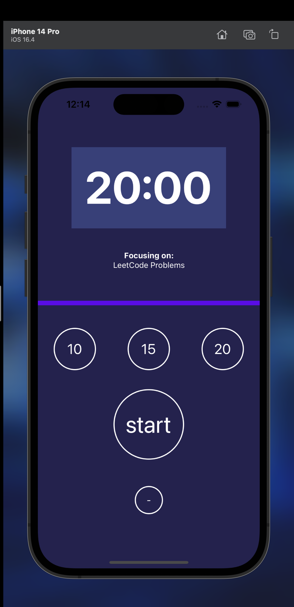
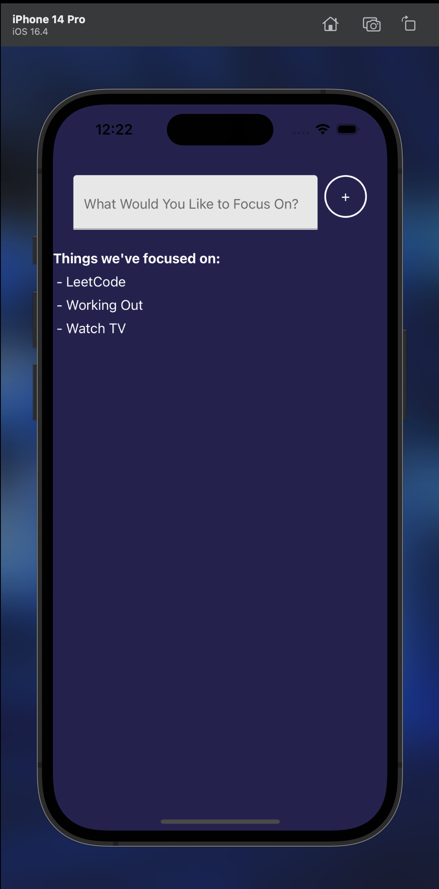

# FocusTimer App

 React-Native app that helps you boost your productivity by breaking your work into focused intervals. It's designed to assist you in managing your tasks effectively and improving your work habits.

## Features

- **Pomodoro Timer**: Utilize the Pomodoro technique for efficient work sessions.
- **Task Tracking**: Keep a record of your focused tasks.
- **Task Deletion**: Remove completed or unnecessary tasks.
- **Task Categories**: Organize tasks into different categories (e.g., work, study, exercise).
- **Customizable Timer**: Adjust focus and break session durations.
- **Notifications**: Get notified when a session starts or ends.

### App UI

- 10 Minute Timer
  
  
- 15 Minute Timer
  
  
- 20 Minute Timer
  

- Tasks history

# Sample Snack app

Open the `App.js` file to start writing some code. You can preview the changes directly on your phone or tablet by scanning the **QR code** or use the iOS or Android emulators. When you're done, click **Save** and share the link!

When you're ready to see everything that Expo provides (or if you want to use your own editor) you can **Download** your project and use it with [expo cli](https://docs.expo.dev/get-started/installation/#expo-cli)).

All projects created in Snack are publicly available, so you can easily share the link to this project via link, or embed it on a web page with the `<>` button.

If you're having problems, you can tweet to us [@expo](https://twitter.com/expo) or ask in our [forums](https://forums.expo.dev/c/expo-dev-tools/61) or [Discord](https://chat.expo.dev/).

Snack is Open Source. You can find the code on the [GitHub repo](https://github.com/expo/snack).

